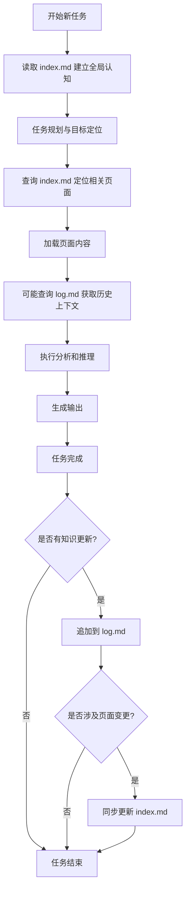

# LLM Wiki 索引创建与管理 Skill

## 概述
该 skill 用于创建和管理 LLM Wiki 索引系统，包括 index.md 和 log.md 两个核心文件。index.md 作为内容导向的索引文件，提供知识库的目录和内容概览；log.md 作为操作历史记录文件，记录所有知识获取、编辑、查询等操作的详细上下文。

## 1. 执行摘要

**index.md** 作为内容导向的索引文件，承担着知识库的「目录」职能。它通过结构化的分类组织、一行摘要和元数据标注，使 LLM 和人类用户能够快速定位所需信息，实现知识的高效发现与导航。index.md 的设计哲学强调「内容优先」——索引本身不是独立文档，而是对 Wiki 页面群组的元数据抽象描述。

**log.md** 作为操作历史记录文件，承担着知识库的「日志」职能。它记录每一次知识获取、编辑、查询等操作的详细上下文，为系统提供可追溯性保障，支持增量学习的证据链构建，以及问题诊断和调试分析。log.md 的设计哲学强调「过程优先」——不仅记录结果，更记录达成结果的过程与方法。

两个文件的协同工作构成了 LLM Wiki 的完整信息闭环：index.md 提供「当前知识状态」的快照视图，log.md 提供「知识演进历史」的时间线视图。LLM 在执行任务时，通过读取 index.md 建立全局认知，通过追加 log.md 记录操作轨迹，通过查询两者实现知识的有序积累与有效复用。

---

## 2. index.md 深度解析

### 2.1 设计原理：为什么需要内容导向的索引

在传统的文档管理场景中，索引往往是可选的辅助工具——用户可以通过文件系统浏览、搜索引擎或文档内部的目录来定位信息。然而，在 LLM Wiki 系统中，index.md 的存在具有更为根本的必要性，这源于 LLM 的工作特性和知识管理面临的独特挑战。

**LLM 的上下文窗口限制**是首要考量因素。当 LLM 处理复杂任务时，其上下文窗口是有限的资源。在一个包含数百个页面的 Wiki 知识库中，LLM 不可能一次性加载所有内容进行分析。index.md 提供了一个「索引窗口」——它以极小的体积（通常只有源文件的 1%-5%）承载了全库的内容概览，使 LLM 能够在保持上下文效率的前提下，获得对整个知识库的全局感知。

**知识的语义关联需求**是第二个关键因素。Wiki 中的页面并非孤立存在——概念之间存在层级关系、因果链条、对比关系等多种语义联系。index.md 通过分类组织、标签系统和关系图谱，让这些隐式关联显式化，帮助 LLM 建立对知识结构的深层理解，而非停留在表面的文档罗列层面。

**增量更新的一致性保障**是第三个设计动因。Wiki 系统在持续运行过程中会不断新增页面、修改内容、删除过时信息。如果没有统一的索引文件，新增内容可能长期「隐藏」在文件系统中无人知晓，过时内容可能继续被引用而不知其已失效。index.md 作为单一事实来源（Single Source of Truth），确保了索引与实际内容的一致性同步。

从设计模式的角度审视，index.md 采用了**元数据驱动架构**（Metadata-Driven Architecture）。它将「关于信息的信息」与「信息本身」分离存储，这种解耦带来了多重优势：索引可以独立于内容进行快速检索和过滤；索引可以采用不同于内容的格式以优化特定查询模式；索引的更新频率可以独立于内容进行调优。

### 2.2 核心功能：导航、发现、概览

index.md 的功能设计围绕三个核心场景展开，每个场景对应不同的用户需求和使用模式。

**导航功能**是 index.md 最直接的应用场景。当用户或 LLM 知道自己在寻找什么类型的知识时，index.md 提供了明确的路径指引。导航功能的核心价值在于减少搜索成本——通过分类层级和标签筛选，用户可以快速缩小目标范围，而无需遍历整个文件系统。典型的导航查询包括：「找一下关于机器学习概念的所有页面」「列出所有已完成的源文档摘要」「查看某个特定实体的详细信息」。

**发现功能**是 index.md 的高级应用。当用户还不确定需要什么具体内容时，index.md 提供了探索知识的入口。通过浏览分类结构、查看标签云、了解页面间的关联关系，用户可以逐渐聚焦兴趣领域。这种「浏览式发现」模式特别适合研究新主题、寻找灵感或建立对陌生领域的整体认知。发现功能的实现依赖于 index.md 中丰富的元数据和清晰的分类逻辑。

**概览功能**使 index.md 成为知识库的「迷你地图」。无论是评估 Wiki 的完整性和覆盖范围，还是了解某个特定领域的知识密度，用户都可以通过阅读 index.md 获得全局视图。概览功能对于知识管理者的决策支持尤为重要——它揭示了哪些领域已充分覆盖，哪些领域仍是空白，指导后续的知识采集优先级。

以下表格概括了 index.md 三个核心功能的对比：

| 功能维度 | 导航 | 发现 | 概览 |
|---------|------|------|------|
| 用户状态 | 目标明确 | 目标模糊 | 评估需求 |
| 操作模式 | 检索与筛选 | 浏览与探索 | 统计与分析 |
| 输出形式 | 具体页面引用 | 相关页面列表 | 覆盖率报告 |
| 典型用户 | 执行任务中的 LLM | 研究探索中的人类 | 知识管理者 |

### 2.3 结构设计原则：分类组织、一行摘要、元数据

一个设计良好的 index.md 需要遵循三项核心原则，这些原则共同确保了索引的可读性、可维护性和可扩展性。

**分类组织原则**要求页面按照某种逻辑体系进行分组。常见的分类维度包括：

- **内容类型**：概念（concept）、实体（entity）、事件（event）、人物（person）、地点（location）等
- **知识领域**：计算机科学、商业、生物、化学、物理、人文等
- **处理状态**：待处理（pending）、进行中（in-progress）、已完成（completed）、已废弃（deprecated）
- **来源类型**：一手研究（primary）、二手综述（secondary）、官方文档（official）、社区讨论（community）
- **时间维度**：历史（historical）、当前（current）、预测（projected）

分类组织的设计要点在于层次适度——分类层级过浅会导致同类页面过多难以筛选，层级过深会导致定位路径冗长。实践经验表明，2-4 层分类结构能够平衡这两方面需求。此外，同一个页面可能属于多个分类，标签系统提供了这种「多维度归属」的实现方式。

**一行摘要原则**规定每个索引条目都应该用一行简洁的文字（通常 50-100 字符）概括页面核心内容。一行摘要的价值在于提供快速上下文——用户在浏览索引时，无需打开每个页面就能了解其主要内容是什么。一行摘要的写作应遵循以下规范：

- 使用陈述性语言，而非疑问句或标题式短语
- 聚焦「是什么」和「有什么用」，而非「怎么做」
- 避免与页面标题重复的信息
- 使用领域通用的术语，提高可搜索性

**元数据原则**要求为每个条目附加结构化的属性信息。常用的元数据字段包括：

- `tags`：标签列表，用于多维度分类和筛选
- `status`：处理状态，指示页面的完成度和可靠性
- `updated`：最后更新时间，支持识别内容新鲜度
- `related`：关联页面列表，揭示知识间的语义联系
- `confidence`：置信度评分（可选），指示内容的可靠程度
- `source`：信息来源，追踪知识的原始出处

元数据的设计应保持一致性——所有条目使用相同的字段结构，这使得后续的自动化处理成为可能。同时，元数据字段应保持精简，只保留真正有检索价值的属性，避免索引过于臃肿。

### 2.4 实例展示：index.md 示例代码

以下是一个完整的 index.md 示例，展示了上述设计原则的实际应用：

```markdown
# LLM Wiki 索引

> 本索引提供了 Wiki 知识库的内容概览，按分类组织，包含每个页面的一行摘要和关键元数据。
> 最后更新时间：2026-04-07 | 总页面数：42 | 索引版本：2.3

---

## 概念（Concepts）

### 机器学习基础

| 页面 | 摘要 | 标签 | 状态 | 更新 |
|------|------|------|------|------|
| [监督学习.md](./concepts/ml/supervised-learning.md) | 通过标注数据训练模型进行预测的学习范式，包含分类与回归两大任务类型 | ml, fundamentals, supervised | completed | 2026-03-15 |
| [无监督学习.md](./concepts/ml/unsupervised-learning.md) | 无标注数据下发现数据内在结构的学习方法，包括聚类、降维和密度估计 | ml, fundamentals, unsupervised | completed | 2026-03-18 |
| [神经网络基础.md](./concepts/ml/neural-networks.md) | 由多层神经元组成的函数逼近器，通过反向传播进行训练 | ml, deep-learning, fundamentals | completed | 2026-04-01 |
| [注意力机制.md](./concepts/ml/attention-mechanism.md) | 让模型动态关注输入序列中相关部分的核心技术，是 Transformer 的基础 | ml, deep-learning, nlp | completed | 2026-04-05 |
| [迁移学习.md](./concepts/ml/transfer-learning.md) | 将一个任务上学到的知识迁移到另一个相关任务的技术 | ml, techniques | in-progress | 2026-03-28 |

### 自然语言处理

| 页面 | 摘要 | 标签 | 状态 | 更新 |
|------|------|------|------|------|
| [词嵌入.md](./concepts/nlp/word-embeddings.md) | 将词汇映射到稠密向量空间的技术，捕捉语义相似性 | nlp, embeddings, word2vec, glove | completed | 2026-03-20 |
| [Transformer架构.md](./concepts/nlp/transformer.md) | 基于自注意力机制的序列建模架构，是现代大语言模型的基础 | nlp, architecture, attention | completed | 2026-04-02 |
| [大语言模型.md](./concepts/nlp/llm.md) | 基于大规模预训练的能处理多种语言任务的深度学习模型 | nlp, llm, gpt, bert | completed | 2026-04-06 |
| [提示工程.md](./concepts/nlp/prompt-engineering.md) | 设计输入提示以优化 LLM 输出质量的技术与策略 | nlp, llm, techniques | in-progress | 2026-03-30 |

---

## 实体（Entities）

### 商业与技术公司

| 页面 | 摘要 | 标签 | 状态 | 更新 |
|------|------|------|------|------|
| [OpenAI.md](./entities/companies/openai.md) | 致力于开发有益通用人工智能的研究机构，创建了 GPT 系列和 DALL-E | ai, research, gpt, company | completed | 2026-04-07 |
| [Anthropic.md](./entities/companies/anthropic.md) | 专注于 AI 安全和研究的公司，开发了 Claude 系列模型 | ai, safety, claude, company | completed | 2026-04-05 |
| [Google DeepMind.md](./entities/companies/google-deepmind.md) | Alphabet 旗下的 AI 研究部门，开发了 AlphaGo 和 Gemini 系列 | ai, research, alpha, company | completed | 2026-04-03 |
| [Meta AI.md](./entities/companies/meta-ai.md) | Meta 的 AI 研究部门，开源了 LLaMA 系列模型 | ai, research, llama, company | completed | 2026-03-25 |

### AI 产品与服务

| 页面 | 摘要 | 标签 | 状态 | 更新 |
|------|------|------|------|------|
| [GPT-4.md](./entities/products/gpt4.md) | OpenAI 的最新多模态大语言模型，在推理和编程方面表现卓越 | openai, gpt4, llm, multimodal | completed | 2026-04-07 |
| [Claude 3.md](./entities/products/claude3.md) | Anthropic 开发的大模型家族，以长上下文和安全对齐著称 | anthropic, claude, llm, long-context | completed | 2026-04-06 |
| [Gemini.md](./entities/products/gemini.md) | Google 原生的多模态 AI 模型，支持文本、图像、音频和视频 | google, multimodal, llm | completed | 2026-04-01 |
| [LLaMA 3.md](./entities/products/llama3.md) | Meta 开源的大语言模型系列，在开源社区广泛使用 | meta, open-source, llm | completed | 2026-03-28 |

---

## 来源摘要（Source Summaries）

### 学术论文

| 页面 | 摘要 | 标签 | 状态 | 引用 |
|------|------|------|------|------|
| [Attention Is All You Need](./sources/papers/attention-all-you-need.md) | Transformer 架构的原始论文，引入自注意力机制替代 RNN | nlp, transformer, seminal, 2017 | completed | Vaswani et al., 2017 |
| [BERT Pre-training](./sources/papers/bert-paper.md) | 提出双向编码器表示的预训练方法，刷新 NLP 任务基准 | nlp, bert, pre-training, 2018 | completed | Devlin et al., 2018 |
| [GPT-3 Paper](./sources/papers/gpt3-paper.md) | 展示大规模语言模型的涌现能力和少样本学习潜力 | llm, gpt3, few-shot, 2020 | completed | Brown et al., 2020 |

### 技术报告

| 页面 | 摘要 | 标签 | 状态 | 来源 |
|------|------|------|------|------|
| [GPT-4 Technical Report](./sources/tech-reports/gpt4-tech-report.md) | OpenAI 关于 GPT-4 能力评估和安全分析的技术报告 | openai, gpt4, technical | completed | OpenAI, 2024 |
| [Claude 3 Model Card](./sources/tech-reports/claude3-model-card.md) | Anthropic 关于 Claude 3 系列模型的规格和评估文档 | anthropic, claude3, model-card | completed | Anthropic, 2024 |

---

## 综合页（Syntheses）

综合页是融合多个来源、表达原创观点的高价值页面。

| 页面 | 摘要 | 标签 | 状态 | 更新 |
|------|------|------|------|------|
| [大模型技术演进史.md](./syntheses/llm-evolution.md) | 从 ELMo 到 GPT-4 的大语言模型发展脉络与关键技术突破 | history, llm, overview | completed | 2026-04-06 |
| [AI Agent 架构综述.md](./syntheses/ai-agent-architecture.md) | 自主 AI Agent 的核心组件、能力边界与现有局限性分析 | agent, architecture, overview | in-progress | 2026-04-03 |
| [RAG 与微调对比.md](./syntheses/rag-vs-finetuning.md) | 两种主流 LLM 定制化方法的技术原理、适用场景和权衡分析 | rag, finetuning, comparison | completed | 2026-04-05 |

---

## 待处理（Pending）

以下页面正在创建或更新中，尚未达到完成状态。

| 页面 | 计划内容 | 优先级 | 负责人 |
|------|----------|--------|--------|
| [多模态学习.md](./pending/multimodal-learning.md) | 整合文本、图像、视频的联合学习范式 | 高 | Agent-01 |
| [AI 安全与对齐.md](./pending/ai-safety-alignment.md) | 确保 AI 系统目标与人类价值观一致的技术与挑战 | 高 | Agent-02 |
| [知识图谱构建.md](./pending/knowledge-graph.md) | 从非结构化文本中提取实体和关系构建知识图谱的方法 | 中 | Agent-03 |
| [模型压缩技术.md](./pending/model-compression.md) | 知识蒸馏、量化和剪枝等降低模型计算需求的技术 | 中 | Agent-04 |

---

## 标签索引

| 标签 | 页面数 | 相关标签 |
|------|--------|----------|
| [llm](./tags/llm.md) | 12 | gpt4, bert, llama, transformer |
| [nlp](./tags/nlp.md) | 8 | embeddings, transformer, bert |
| [ml](./tags/ml.md) | 15 | deep-learning, supervised, unsupervised |
| [deep-learning](./tags/deep-learning.md) | 9 | ml, neural-networks, attention |
| [company](./tags/company.md) | 5 | openai, anthropic, google-deepmind |
| [open-source](./tags/open-source.md) | 3 | llama, meta, community |
| [safety](./tags/safety.md) | 4 | alignment, anthropic, ethics |

---

*本索引由自动化脚本维护，修改请确保同步更新对应页面的元数据。*
```

---

## 3. log.md 深度解析

### 3.1 设计原理：为什么需要操作历史记录

如果说 index.md 是 LLM Wiki 的「空间索引」，那么 log.md 就是其「时间索引」。log.md 记录了知识库生命周期中的每一次重要操作，为系统提供了时间维度上的可追溯性。这种设计借鉴了软件工程中版本控制和日志记录的最佳实践，但其针对 LLM 工作场景进行了专门的优化。

**增量学习的证据链**是 log.md 存在的首要原因。LLM 的知识获取往往不是一次性完成的，而是通过多轮交互逐步深化。每一次信息采集、每一条假设验证、每一次假设修正都应该被记录下来。log.md 提供了这种「思考过程的外化」——它不仅记录最终结论，还记录得出结论的方法和依据。这对于后续审查、审计和知识追溯至关重要。当用户质疑某个结论时，可以通过回溯 log.md 了解当时的信息来源和推理过程。

**调试和问题诊断**是 log.md 的第二个核心应用场景。LLM 在执行复杂任务时可能会犯错，或者产生意想不到的结果。log.md 提供了完整的操作轨迹，使得问题定位和根因分析成为可能。例如，如果 LLM 在回答某个问题时给出了错误信息，开发者可以通过 log.md 查看该信息是何时被摄入的、由哪次查询触发、以何种方式整合到知识库中的，从而识别知识污染或过时信息的来源。

**系统健康监控**受益于 log.md 的结构化记录。通过分析 log.md 中的操作模式，可以识别知识库的演变趋势：哪些主题被频繁访问和更新、哪些领域长期未被关注、知识摄入的速率是否稳定、是否存在异常的操作模式（如大量删除、重复更新等）。这些洞察支持知识管理者的战略性决策。

**协作与审计支持**是 log.md 在多用户环境中的重要价值。当多个 LLM Agent 或人类协作者共同维护同一个 Wiki 时，log.md 提供了清晰的职责归属和操作记录。每个变更都可以追溯到具体的操作者和操作时间，这在合规要求较高的环境中尤为必要。

### 3.2 核心功能：可追溯性、调试、增量学习证据

log.md 的功能设计服务于三个核心场景，每个场景对应不同的使用需求。

**可追溯性功能**确保每一个知识条目都可以追踪到其原始来源和获取时间。可追溯性的实现依赖于严格的时间戳格式、唯一的操作标识符以及完整的上下文记录。当用户或 LLM 查询某个知识点时，log.md 允许他们追溯该知识是何时被首次添加、经过多少次修改、最近一次更新是什么时候、原始来源是什么。这种透明度增强了知识库的可信度。

**调试功能**支持问题诊断和错误修复。LLM 系统的调试具有独特挑战——模型的推理过程是隐式的，难以直接观察。log.md 通过记录完整的操作上下文，在一定程度上「打开」了这个黑箱。调试功能的核心是上下文完整性：记录操作触发时的查询、使用的上下文窗口、检索到的相关文档、最终的输出以及任何中间推理步骤。当问题发生时，这些信息组合起来可以重建当时的决策过程。

**增量学习证据功能**记录知识演进的完整轨迹。在持续运行的知识系统中，新信息不断被摄入，旧信息可能被修正或废弃。增量学习证据的价值在于，它不仅记录「是什么」，还记录「怎么知道的」和「为什么变了」。例如，当一个假设被推翻时，log.md 会记录推翻的原因（如发现了新的反例证据）和时间，这比简单删除旧信息更能保留知识的演进价值。

### 3.3 格式设计：结构化日志条目格式

log.md 的格式设计需要在人类可读性和机器可解析性之间取得平衡。过于简化的格式难以支持复杂查询，过于复杂的格式又会影响可写性和维护成本。以下是一种经过实践验证的日志条目格式：

```markdown
## 2026-04-07 操作日志

### 10:23:45 UTC | INGEST | session:2026-04-07-001 | tags:[ml,transformer,architecture]

**触发查询**: "请总结一下 Transformer 架构的核心组件和工作原理"

**摄入来源**: ./sources/papers/attention-all-you-need.md
**来源摘要**: 这是一篇 2017 年的 NeurIPS 论文，提出了基于注意力机制的序列转导模型，
             完全放弃了传统的 RNN 和 CNN 结构，在翻译任务上取得了 SOTA 性能。

**处理过程**:
1. 提取了 Transformer 的编码器-解码器结构描述
2. 识别了自注意力、多头注意力、位置编码等核心概念
3. 记录了关键超参数设置（层数、头数、维度等）
4. 关联到现有概念：注意力机制.md（已存在）

**输出结果**: 创建了 ./concepts/nlp/transformer-architecture.md
**知识整合**: 补充了 index.md 中 NLP 分类下的相关条目

---

### 10:35:12 UTC | QUERY | session:2026-04-07-001 | tags:[llm,gpt4,capabilities]

**触发查询**: "GPT-4 和 GPT-3.5 在推理能力上有什么主要区别？"

**检索路径**:
- index.md → AI 产品与服务 → GPT-4.md
- index.md → 综合页 → 大模型技术演进史.md
- GPT-4.md 中检索 "reasoning" 相关段落

**上下文使用**: 加载了 GPT-4.md 的完整内容（4.2k tokens）
            加载了大模型技术演进史.md 中的对比分析部分（1.8k tokens）

**输出摘要**: GPT-4 在复杂推理、多步问题分解、代码生成等方面显著优于 GPT-3.5，
             这主要归功于更大规模的预训练和基于人类反馈的强化学习（RLHF）微调。

**答案置信度**: 高（多源交叉验证一致）

---

### 11:02:33 UTC | EDIT | session:2026-04-07-001 | tags:[correction,ml,neural-networks]

**触发事件**: 用户反馈 ./concepts/ml/neural-networks.md 中关于「激活函数」的描述不准确

**具体修改**:
- 原文: "ReLU 激活函数总是输出正值"
- 修正为: "ReLU 激活函数输出 max(0, x)，对于负值输入输出 0"
- 修正理由: 原描述忽略了 ReLU 对负值的零输出特性，可能导致误解

**关联更新**: 
- 检查了引用 neural-networks.md 的其他页面
- 确认无下游影响（引用位置不涉及激活函数细节）

**审核状态**: 已验证，待合并

---

### 14:18:05 UTC | LINT | session:2026-04-07-002 | tags:[maintenance,consistency]

**检查类型**: 索引一致性检查
**执行脚本**: check_index_consistency.py v1.2

**发现问题**:
1. orphaned_pages: [./deprecated/old-rnn-guide.md] - 存在但未在任何分类下引用
2. missing_summaries: [./entities/products/new-model-x.md] - 存在但 index.md 中缺少摘要
3. broken_links: [./sources/papers/paper-2023.md] 中的链接指向不存在的锚点

**建议操作**:
1. 确认 old-rnn-guide.md 是否应删除或重新分类
2. 为 new-model-x.md 补充索引摘要
3. 修复 paper-2023.md 中的锚点引用

**自动修复**: 已自动更新 index.md 标签索引部分（检测到 2 个新标签）

---

### 16:45:22 UTC | SYNTHESIZE | session:2026-04-07-003 | tags:[agent,reasoning,summary]

**输入来源**:
- ./concepts/ml/reinforcement-learning.md
- ./concepts/nlp/chain-of-thought.md
- ./concepts/nlp/self-consistency.md
- ./sources/papers/react-prompting.md
- ./sources/tech-reports/agent-frameworks.md

**综合目标**: 整合关于 AI Agent 推理能力的最新研究进展

**综合产出**: ./syntheses/ai-agent-reasoning.md（新创建）

**质量检查**:
- 事实核查: 通过（所有关键声明与来源一致）
- 一致性检查: 通过（术语使用统一）
- 可读性评分: 8.2/10（中等偏上）

**索引更新**: 已添加到 index.md 综合页分类
```

### 3.4 Unix 命令解析示例

log.md 的文本格式使其可以被传统的 Unix 工具高效处理。以下是一些常用的解析和分析命令示例：

```bash
# 统计每日操作数量
grep "^## 20" log.md | cut -d' ' -f2 | sort | uniq -c

# 提取所有摄入操作（INGEST）
grep -A 10 "^###.*INGEST" log.md | grep "**摄入来源**" | sed 's/\*\*摄入来源\*\*: //'

# 查找所有与特定标签相关的操作
grep -B 5 "tags:\[.*llm.*\]" log.md | grep "^###.*UTC"

# 统计操作类型分布
grep "^###.*|" log.md | awk '{print $3}' | sort | uniq -c | sort -rn

# 查找问题诊断记录
grep -A 50 "^###.*LINT" log.md | grep -A 30 "发现问题"

# 提取特定时间范围的操作（2026年4月）
grep -E "^## 2026-04-0[1-7]" log.md

# 查找内容修改记录
grep "^###.*EDIT" log.md -A 20 | grep -E "(具体修改|修正为)" -A 1

# 生成操作时间线
grep "^###" log.md | awk '{print $2, $3}' | sort -t':' -k1,1n -k2,2n

# 查找某个具体页面的所有相关操作
grep -E "(neural-networks\.md|神经网络)" log.md

# 统计每个会话的操作数量
grep "^###.*|" log.md | awk '{print $4}' | sed 's/session://' | sort | uniq -c

# 提取所有来源引用的完整列表
grep "**摄入来源**" log.md -h | sed 's/\*\*摄入来源\*\*: //' | sort | uniq
```

这些命令展示了 log.md 格式设计的优势——通过一致的结构化标记，可以轻松地使用标准文本处理工具进行复杂查询。对于更高级的分析需求，可以将日志解析为结构化数据（如 JSON 或 CSV）后使用专门的工具处理。

---

## 4. 协同工作机制

### 4.1 两个文件如何配合工作

index.md 和 log.md 虽然关注不同维度（空间 vs. 时间），但在实际运作中紧密协作，共同支撑 LLM Wiki 的完整功能。理解这种协作机制是有效使用系统的关键。

**写入协作**是两者同步发生的时刻。当 LLM 执行知识摄入操作时，通常会同时更新两个文件：被摄入的页面内容作为新文件或更新文件保存，同时该操作被追加到 log.md，而 index.md 的相关条目也会被创建或更新。这种「原子操作」确保了三个存储位置（文件系统、索引、日志）的一致性。

```python
# 伪代码示例：知识摄入时的协作写入
def ingest_knowledge(source_file, category, summary, tags):
    # 1. 保存源内容到文件系统
    save_page(source_file)
    
    # 2. 更新索引
    add_to_index(
        page=source_file,
        category=category,
        summary=summary,
        tags=tags,
        status="completed"
    )
    
    # 3. 记录日志
    append_to_log(
        operation="INGEST",
        source=source_file,
        category=category,
        process="知识摄入完成"
    )
```

**读取协作**发生在查询和导航场景中。当 LLM 需要回答一个问题或执行一项任务时，它会首先查阅 index.md 建立全局认知，识别可能相关的页面范围；然后可能查阅 log.md 了解这些页面的历史背景和可靠性；最后才加载具体内容进行分析。这种分层读取策略既保证了信息的全面性，又避免了上下文溢出。

**一致性维护**是两个文件协作的第三个维度。理想情况下，index.md 和文件系统应该始终保持一致——每个在 index.md 中列出的页面都存在，每个存在的页面都在 index.md 中有记录。log.md 中的操作记录为这种一致性提供了保障：如果发现不一致（如孤立的页面文件），可以通过回溯 log.md 了解该页面的来源和后续操作。

### 4.2 LLM 如何利用这两个文件

LLM 与 index.md 和 log.md 的交互模式决定了 Wiki 系统的智能化程度。以下是 LLM 利用这两个文件的典型工作流程：

**初始化阶段**：当 LLM 首次接触一个 Wiki 项目或开始一个新的会话时，它会阅读 index.md 快速建立对知识库的整体认知。这个过程通常只需要几秒钟，但为后续所有操作奠定了基础。通过 index.md，LLM 了解到：知识库覆盖了哪些主题领域、每个领域有哪些页面、页面的组织方式和分类逻辑、以及哪些页面是核心的高价值内容。

**任务规划阶段**：在明确任务目标后，LLM 会利用 index.md 进行目标定位。它可能使用分类导航缩小范围，或使用标签筛选快速定位相关页面。对于复杂任务，LLM 可能会同时参考 index.md 和 log.md——前者了解「现在有什么」，后者了解「最近新增了什么」和「哪些领域被重点关注」。

**内容获取阶段**：通过 index.md 识别目标页面后，LLM 加载实际内容进行分析。在加载过程中，log.md 可能提供额外上下文：这条信息是什么时候摄入的？之后有没有被修改过？用户之前是否对类似问题有过反馈？这些信息帮助 LLM 评估内容的时效性和可靠性。

**知识输出阶段**：LLM 基于获取的知识生成回答或执行任务。在这个过程中，它可能会标记哪些信息来自 Wiki、哪些是推理结论、置信度如何。这些元信息对于后续的日志记录很重要。

**记录归档阶段**：任务完成后，LLM 会将操作记录追加到 log.md。如果任务涉及知识摄入或修改，还需要同步更新 index.md。良好的归档习惯确保了知识库的持续积累和可追溯性。



---

## 5. 进阶实践

### 5.1 分层索引设计

对于规模较大的 Wiki 系统，单一的 index.md 可能变得臃肿且难以维护。分层索引设计通过引入多级索引文件来解决这个问题，同时保持全局可导航性。

**第一层：根索引**（index.md）
根索引是系统的入口点，包含了最精简的内容概览。它按顶级分类组织，每个分类只列出该类别的高层次摘要和指向第二层索引的链接。根索引应该保持紧凑，通常不超过 200 行。

```markdown
# LLM Wiki 索引

[完整内容索引](./indices/full-index.md) | [最近更新](./indices/recent-updates.md) | [标签云](./indices/tags.md)

## 机器学习
涵盖监督学习、无监督学习、深度学习、强化学习等基础概念
[详细内容索引](./indices/concepts-ml.md) | [待处理项目](./indices/pending-ml.md)

## 自然语言处理
涵盖词嵌入、序列建模、Transformer、大语言模型等核心主题
[详细内容索引](./indices/concepts-nlp.md) | [待处理项目](./indices/pending-nlp.md)

## 公司与产品
涵盖主要 AI 公司、主要 AI 产品和服务的详细信息
[详细内容索引](./entities/index.md) | [新增产品](./entities/new-products.md)

## 来源文档
涵盖学术论文、技术报告、官方文档等原始资料摘要
[详细内容索引](./sources/index.md) | [高影响力论文](./sources/high-impact.md)
```

**第二层：分类索引**
每个顶级分类有自己的索引文件，列出该分类下的所有页面详情。分类索引是主要的浏览和导航工具，用户通常在这里进行详细的内容发现。

**第三层：动态视图**
除了静态的层级索引，还可以创建动态视图来支持特定查询需求：

- `recent-updates.md`：最近 30 天更新的页面列表
- `orphaned-pages.md`：未被任何其他页面引用的页面
- `high-confidence.md`：高置信度评估的页面
- `needs-review.md`：标记为需要人工审核的页面
- `by-tag.md`：按标签组织的页面索引

### 5.2 自动生成脚本示例

以下是一个完整的 Python 脚本，用于自动生成和维护 index.md：

```python
#!/usr/bin/env python3
"""
index_generator.py - 自动生成和维护 LLM Wiki 索引

功能：
- 扫描 Wiki 目录结构
- 读取每个页面的元数据
- 生成结构化的 index.md
- 检查索引一致性
- 生成统计报告
"""

import os
import re
import json
from datetime import datetime
from pathlib import Path
from typing import Dict, List, Optional, Tuple
from dataclasses import dataclass, field, asdict
from collections import defaultdict
import argparse

# ============== 配置 ==============

WIKI_ROOT = Path("./wiki")
INDEX_OUTPUT = WIKI_ROOT / "index.md"
CONFIG_FILE = WIKI_ROOT / ".wiki-config.json"

# 默认元数据
DEFAULT_METADATA = {
    "status": "unknown",
    "tags": [],
    "category": "uncategorized"
}

# 分类配置
CATEGORY_STRUCTURE = {
    "concepts": {
        "description": "解释核心概念和原理的页面",
        "subcategories": ["ml", "nlp", "math", "statistics"]
    },
    "entities": {
        "description": "描述具体实体（公司、产品、人物等）的页面",
        "subcategories": ["companies", "products", "people"]
    },
    "sources": {
        "description": "来源文档的摘要和引用信息",
        "subcategories": ["papers", "reports", "articles"]
    },
    "syntheses": {
        "description": "综合多个来源的原创分析页面",
        "subcategories": []
    },
    "tutorials": {
        "description": "教程和实践指南",
        "subcategories": ["beginner", "intermediate", "advanced"]
    },
    "pending": {
        "description": "待创建的页面草稿和计划",
        "subcategories": []
    }
}

# 状态定义
STATUS_DISPLAY = {
    "completed": ("completed", "页面已完成并审核通过"),
    "in-progress": ("in-progress", "页面正在编写中"),
    "pending": ("pending", "页面待创建或待处理"),
    "deprecated": ("deprecated", "页面已废弃或过时"),
    "draft": ("draft", "页面初稿，需要完善")
}

# ============== 数据模型 ==============

@dataclass
class PageMetadata:
    """页面元数据"""
    title: str
    file_path: Path
    summary: str = ""
    tags: List[str] = field(default_factory=list)
    status: str = "unknown"
    updated: str = ""
    created: str = ""
    category: str = "uncategorized"
    related_pages: List[str] = field(default_factory=list)
    confidence: str = ""
    source: str = ""
    
    def to_dict(self) -> Dict:
        return asdict(self)
    
    @classmethod
    def from_dict(cls, data: Dict) -> 'PageMetadata':
        data['file_path'] = Path(data.get('file_path', ''))
        return cls(**data)

@dataclass 
class IndexStats:
    """索引统计信息"""
    total_pages: int = 0
    by_category: Dict[str, int] = field(default_factory=lambda: defaultdict(int))
    by_status: Dict[str, int] = field(default_factory=lambda: defaultdict(int))
    all_tags: Dict[str, int] = field(default_factory=lambda: defaultdict(int))
    recently_updated: List[Tuple[Path, str]] = field(default_factory=list)
    
    def add_page(self, page: PageMetadata):
        self.total_pages += 1
        self.by_category[page.category] += 1
        self.by_status[page.status] += 1
        for tag in page.tags:
            self.all_tags[tag] += 1
        if page.updated:
            self.recently_updated.append((page.file_path, page.updated))

# ============== 解析器 ==============

class MarkdownParser:
    """Markdown 文件解析器"""
    
    FRONT_MATTER_PATTERN = re.compile(
        r'^---\s*\n(.*?)\n---\s*\n',
        re.DOTALL
    )
    
    METADATA_FIELDS = {
        'title': r'(?:title|标题):\s*(.+)',
        'summary': r'(?:summary|摘要|description):\s*(.+)',
        'tags': r'tags:\s*\[([^\]]+)\]',
        'status': r'status:\s*(\w+)',
        'updated': r'(?:updated|更新|modified):\s*([\d\-]+)',
        'created': r'(?:created|创建):\s*([\d\-]+)',
        'category': r'category:\s*(.+)',
        'related': r'(?:related|related_pages|关联):\s*\[([^\]]+)\]',
        'confidence': r'confidence:\s*(\w+)',
        'source': r'(?:source|来源):\s*(.+)'
    }
    
    @classmethod
    def extract_front_matter(cls, content: str) -> Dict:
        """提取 YAML front matter"""
        match = cls.FRONT_MATTER_PATTERN.match(content)
        if not match:
            return {}
        
        front_matter = {}
        for line in match.group(1).strip().split('\n'):
            if ':' in line:
                key, value = line.split(':', 1)
                front_matter[key.strip()] = value.strip()
        
        return front_matter
    
    @classmethod
    def extract_metadata(cls, file_path: Path) -> PageMetadata:
        """从 Markdown 文件提取元数据"""
        try:
            with open(file_path, 'r', encoding='utf-8') as f:
                content = f.read()
        except Exception as e:
            print(f"Error reading {file_path}: {e}")
            return PageMetadata(
                title=file_path.stem,
                file_path=file_path
            )
        
        # 提取 front matter
        front_matter = cls.extract_front_matter(content)
        
        # 提取文件中的元数据
        metadata = {}
        for field_name, pattern in cls.METADATA_FIELDS.items():
            match = re.search(pattern, content, re.IGNORECASE)
            if match:
                value = match.group(1).strip()
                if field_name == 'tags' or field_name == 'related':
                    value = [v.strip() for v in value.split(',')]
                metadata[field_name] = value
        
        # 合并 front matter 和文件内元数据
        metadata.update(front_matter)
        
        # 提取标题（从第一个 # 标题或文件名）
        title_match = re.search(r'^#\s+(.+)$', content, re.MULTILINE)
        title = title_match.group(1).strip() if title_match else file_path.stem.replace('-', ' ')
        
        return PageMetadata(
            title=title,
            file_path=file_path,
            summary=metadata.get('summary', ''),
            tags=metadata.get('tags', []),
            status=metadata.get('status', 'unknown'),
            updated=metadata.get('updated', ''),
            created=metadata.get('created', ''),
            category=metadata.get('category', 'uncategorized'),
            related_pages=metadata.get('related_pages', []),
            confidence=metadata.get('confidence', ''),
            source=metadata.get('source', '')
        )

# ============== 索引生成器 ==============

class IndexGenerator:
    """索引生成器"""
    
    def __init__(self, wiki_root: Path):
        self.wiki_root = wiki_root
        self.pages: List[PageMetadata] = []
        self.stats = IndexStats()
        
    def scan_wiki(self) -> List[PageMetadata]:
        """扫描 Wiki 目录，收集所有页面"""
        pages = []
        
        for md_file in self.wiki_root.rglob("*.md"):
            # 跳过索引文件本身
            if md_file.name in ['index.md', 'README.md', '.wiki-config.json']:
                continue
            
            # 跳过隐藏目录
            if any(part.startswith('.') for part in md_file.parts):
                continue
            
            metadata = MarkdownParser.extract_metadata(md_file)
            
            # 转换为相对路径
            rel_path = md_file.relative_to(self.wiki_root)
            metadata.file_path = rel_path
            
            pages.append(metadata)
            self.stats.add_page(metadata)
        
        self.pages = sorted(pages, key=lambda p: (p.category, p.title))
        return self.pages
    
    def generate_index(self) -> str:
        """生成索引 Markdown 内容"""
        lines = []
        today = datetime.now().strftime("%Y-%m-%d")
        
        # 头部
        lines.append("# LLM Wiki 索引\n")
        lines.append(f"> 本索引提供了 Wiki 知识库的内容概览。")
        lines.append(f"> 最后更新时间：{today} | 总页面数：{self.stats.total_pages}\n")
        lines.append("---\n")
        
        # 按分类组织
        for category, config in CATEGORY_STRUCTURE.items():
            category_pages = [p for p in self.pages if p.category == category]
            
            if not category_pages and category != 'pending':
                continue
            
            lines.append(f"## {category.capitalize()}\n")
            lines.append(f"{config['description']}\n")
            
            if category_pages:
                lines.append(self._generate_category_table(category_pages))
            
            lines.append("")
        
        # 标签索引
        lines.append("## 标签云\n")
        sorted_tags = sorted(self.stats.all_tags.items(), key=lambda x: -x[1])
        tag_lines = [f"[{tag}]({count})" for tag, count in sorted_tags if count >= 1]
        lines.append(", ".join(tag_lines[:50]))  # 限制显示数量
        lines.append("")
        
        # 统计摘要
        lines.append("---\n")
        lines.append("## 统计信息\n")
        lines.append(f"- 总页面数：{self.stats.total_pages}")
        lines.append(f"- 已完成：{self.stats.by_status.get('completed', 0)}")
        lines.append(f"- 进行中：{self.stats.by_status.get('in-progress', 0)}")
        lines.append(f"- 待处理：{self.stats.by_status.get('pending', 0)}")
        lines.append(f"- 不同标签数：{len(self.stats.all_tags)}")
        
        return "\n".join(lines)
    
    def _generate_category_table(self, pages: List[PageMetadata]) -> str:
        """生成分类页面表格"""
        lines = []
        lines.append("| 页面 | 摘要 | 标签 | 状态 |")
        lines.append("|------|------|------|------|")
        
        for page in pages[:20]:  # 限制每个分类显示数量
            tags_str = ", ".join(page.tags[:5])
            status_display = STATUS_DISPLAY.get(page.status, (page.status, ""))[0]
            
            # 创建相对链接
            link = f"[{page.title}]({page.file_path})"
            
            # 截断过长摘要
            summary = page.summary[:60] + "..." if len(page.summary) > 60 else page.summary

            lines.append(f"| {link} | {summary} | {tags_str} | {status_display} |")
        
        if len(pages) > 20:
            lines.append(f"\n*... 还有 {len(pages) - 20} 个页面，请查看完整索引*\n")
        
        return "\n".join(lines)
    
    def save_index(self, output_path: Optional[Path] = None):
        """保存索引文件"""
        output = output_path or INDEX_OUTPUT
        
        with open(output, 'w', encoding='utf-8') as f:
            f.write(self.generate_index())
        
        print(f"索引已生成: {output}")
        print(f"共索引 {self.stats.total_pages} 个页面")

# ============== 主程序 ==============

def main():
    parser = argparse.ArgumentParser(description="LLM Wiki 索引生成器")
    parser.add_argument("--wiki-root", type=Path, default=WIKI_ROOT,
                       help="Wiki 根目录路径")
    parser.add_argument("--output", type=Path, default=INDEX_OUTPUT,
                       help="索引输出路径")
    parser.add_argument("--dry-run", action="store_true",
                       help="仅显示将要生成的内容，不保存文件")
    
    args = parser.parse_args()
    
    generator = IndexGenerator(args.wiki_root)
    generator.scan_wiki()
    
    if args.dry_run:
        print(generator.generate_index())
    else:
        generator.save_index(args.output)

if __name__ == "__main__":
    main()
```

### 5.3 解析工具示例

以下脚本用于解析和查询 log.md 的内容：

```python
#!/usr/bin/env python3
"""
log_parser.py - log.md 解析和查询工具

功能：
- 解析结构化日志条目
- 支持按时间、操作类型、标签等维度查询
- 生成统计报告
- 检测异常操作模式
"""

import re
from datetime import datetime, timedelta
from pathlib import Path
from typing import Dict, List, Optional, Tuple
from dataclasses import dataclass, field
from collections import defaultdict
import argparse
import json

@dataclass
class LogEntry:
    """日志条目"""
    timestamp: datetime
    operation: str
    session: str
    tags: List[str]
    query: str = ""
    source: str = ""
    result: str = ""
    details: Dict[str, str] = field(default_factory=dict)
    
    @property
    def date_str(self) -> str:
        return self.timestamp.strftime("%Y-%m-%d")
    
    @property
    def time_str(self) -> str:
        return self.timestamp.strftime("%H:%M:%S UTC")

class LogParser:
    """日志解析器"""
    
    # 日志条目分隔符
    ENTRY_PATTERN = re.compile(
        r'^---\s*$',
        re.MULTILINE
    )
    
    # 时间戳模式
    TIMESTAMP_PATTERN = re.compile(
        r'^### (\d{2}:\d{2}:\d{2} UTC) \| (\w+) \| session:(\S+) \| tags:\[([^\]]+)\]'
    )
    
    # 字段提取模式
    FIELD_PATTERNS = {
        'query': re.compile(r'\*\*触发查询\*\*:\s*(.+)'),
        'source': re.compile(r'\*\*摄入来源\*\*:\s*(.+)'),
        'output': re.compile(r'\*\*输出结果\*\*:\s*(.+)'),
        'output_summary': re.compile(r'\*\*输出摘要\*\*:\s*(.+)'),
        'confidence': re.compile(r'\*\*答案置信度\*\*:\s*(.+)'),
        'problem': re.compile(r'\*\*具体修改\*\*:\s*\n(.+)', re.DOTALL),
    }
    
    @classmethod
    def parse_timestamp(cls, timestamp_str: str) -> datetime:
        """解析时间戳字符串"""
        return datetime.strptime(timestamp_str, "%Y-%m-%d")
    
    @classmethod
    def parse_entry(cls, entry_text: str, date: str) -> Optional[LogEntry]:
        """解析单个日志条目"""
        lines = entry_text.strip().split('\n')
        if not lines:
            return None
        
        # 解析头部
        header_match = cls.TIMESTAMP_PATTERN.match(lines[0])
        if not header_match:
            return None
        
        time_str, operation, session, tags_str = header_match.groups()
        timestamp = datetime.strptime(f"{date} {time_str.replace(' UTC', '+0000')}", 
                                      "%Y-%m-%d %H:%M:%S %z")
        
        entry = LogEntry(
            timestamp=timestamp,
            operation=operation,
            session=session,
            tags=[t.strip() for t in tags_str.split(',')]
        )
        
        # 解析字段
        entry_text_joined = '\n'.join(lines[1:])
        
        for field_name, pattern in cls.FIELD_PATTERNS.items():
            match = pattern.search(entry_text_joined)
            if match:
                setattr(entry, field_name, match.group(1).strip())
        
        return entry
    
    @classmethod
    def parse_log_file(cls, log_path: Path) -> Tuple[List[LogEntry], Dict]:
        """解析整个日志文件"""
        with open(log_path, 'r', encoding='utf-8') as f:
            content = f.read()
        
        # 按日期分割
        date_pattern = re.compile(r'^## (\d{4}-\d{2}-\d{2}) 操作日志', re.MULTILINE)
        date_sections = date_pattern.split(content)
        
        entries = []
        for i in range(1, len(date_sections), 2):
            date = date_sections[i]
            section_content = date_sections[i + 1] if i + 1 < len(date_sections) else ""
            
            # 按分隔符分割条目
            entry_texts = re.split(r'\n---\n', section_content)
            
            for entry_text in entry_texts:
                entry = cls.parse_entry(entry_text.strip(), date)
                if entry:
                    entries.append(entry)
        
        return entries, {}
    
    @classmethod
    def filter_entries(
        cls,
        entries: List[LogEntry],
        operation: Optional[str] = None,
        tags: Optional[List[str]] = None,
        date_from: Optional[datetime] = None,
        date_to: Optional[datetime] = None,
        session: Optional[str] = None,
        search_text: Optional[str] = None
    ) -> List[LogEntry]:
        """过滤日志条目"""
        filtered = entries
        
        if operation:
            filtered = [e for e in filtered if e.operation == operation]
        
        if tags:
            filtered = [e for e in filtered if any(t in e.tags for t in tags)]
        
        if date_from:
            filtered = [e for e in filtered if e.timestamp >= date_from]
        
        if date_to:
            filtered = [e for e in filtered if e.timestamp <= date_to]
        
        if session:
            filtered = [e for e in filtered if e.session == session]
        
        if search_text:
            search_lower = search_text.lower()
            filtered = [e for e in filtered 
                      if search_lower in e.query.lower()
                      or search_lower in e.source.lower()
                      or search_lower in e.result.lower()]
        
        return filtered

class LogAnalyzer:
    """日志分析器"""
    
    def __init__(self, entries: List[LogEntry]):
        self.entries = entries
    
    def get_operation_stats(self) -> Dict:
        """获取操作统计"""
        stats = defaultdict(int)
        for entry in self.entries:
            stats[entry.operation] += 1
        return dict(stats)
    
    def get_tag_stats(self) -> Dict:
        """获取标签统计"""
        tag_counts = defaultdict(int)
        for entry in self.entries:
            for tag in entry.tags:
                tag_counts[tag] += 1
        return dict(sorted(tag_counts.items(), key=lambda x: -x[1]))
    
    def get_daily_stats(self) -> Dict:
        """获取每日统计"""
        daily = defaultdict(int)
        for entry in self.entries:
            daily[entry.date_str] += 1
        return dict(sorted(daily.items()))
    
    def get_session_stats(self) -> Dict:
        """获取会话统计"""
        sessions = defaultdict(lambda: {'operations': 0, 'date': None})
        for entry in self.entries:
            sessions[entry.session]['operations'] += 1
            sessions[entry.session]['date'] = entry.date_str
        return dict(sessions)
    
    def get_sources_ingested(self) -> List[str]:
        """获取所有摄入的来源"""
        sources = []
        for entry in self.entries:
            if entry.source and entry.operation == 'INGEST':
                sources.append(entry.source)
        return sources
    
    def generate_report(self) -> str:
        """生成分析报告"""
        lines = []
        lines.append("# Log 分析报告\n")
        
        lines.append(f"总条目数: {len(self.entries)}")
        lines.append(f"时间范围: {self.entries[0].date_str if self.entries else 'N/A'} - "
                    f"{self.entries[-1].date_str if self.entries else 'N/A'}")
        lines.append(f"会话数: {len(set(e.session for e in self.entries))}")
        lines.append("")
        
        lines.append("## 操作类型分布\n")
        op_stats = self.get_operation_stats()
        for op, count in sorted(op_stats.items(), key=lambda x: -x[1]):
            lines.append(f"- {op}: {count}")
        lines.append("")
        
        lines.append("## 标签频率\n")
        tag_stats = self.get_tag_stats()
        for tag, count in list(tag_stats.items())[:15]:
            lines.append(f"- {tag}: {count}")
        lines.append("")
        
        lines.append("## 来源摄入列表\n")
        sources = self.get_sources_ingested()
        for source in sorted(set(sources)):
            lines.append(f"- {source}")
        
        return "\n".join(lines)

def main():
    parser = argparse.ArgumentParser(description="log.md 解析工具")
    parser.add_argument("log_file", type=Path, help="日志文件路径")
    parser.add_argument("--operation", "-o", help="按操作类型过滤")
    parser.add_argument("--tags", "-t", nargs='+', help="按标签过滤")
    parser.add_argument("--search", "-s", help="搜索文本")
    parser.add_argument("--from", dest='date_from', help="开始日期 (YYYY-MM-DD)")
    parser.add_argument("--to", dest='date_to', help="结束日期 (YYYY-MM-DD)")
    parser.add_argument("--session", help="按会话过滤")
    parser.add_argument("--report", action='store_true', help="生成分析报告")
    parser.add_argument("--json", action='store_true', help="JSON 格式输出")
    
    args = parser.parse_args()
    
    entries, _ = LogParser.parse_log_file(args.log_file)
    
    # 应用过滤器
    date_from = None
    date_to = None
    if args.date_from:
        date_from = datetime.strptime(args.date_from, "%Y-%m-%d")
    if args.date_to:
        date_to = datetime.strptime(args.date_to, "%Y-%m-%d")
    
    filtered = LogParser.filter_entries(
        entries,
        operation=args.operation,
        tags=args.tags,
        date_from=date_from,
        date_to=date_to,
        session=args.session,
        search_text=args.search
    )
    
    if args.report:
        analyzer = LogAnalyzer(filtered)
        print(analyzer.generate_report())
    elif args.json:
        print(json.dumps([e.__dict__ for e in filtered], default=str, indent=2))
    else:
        for entry in filtered:
            print(f"{entry.timestamp} | {entry.operation} | {entry.session} | {','.join(entry.tags)}")
            if entry.query:
                print(f"  Query: {entry.query[:80]}...")
            print()

if __name__ == "__main__":
    main()
```

### 5.4 扩展功能：标签系统与关系图谱

**标签系统**是 index.md 的重要扩展，它允许页面以多维度的方式进行组织和检索。一个设计良好的标签系统应遵循以下原则：

- **层级标签**：使用冒号分隔表示层级，如 `ml:deep-learning:transformer`
- **统一命名**：整个 Wiki 使用一致的标签词汇表
- **避免冗余**：标签不应与分类重复，每个标签应有其独特价值
- **适度粒度**：标签数量应适度，过多会导致标签失去筛选价值

```markdown
## 标签定义词汇表

| 标签 | 含义 | 父标签 | 相关标签 |
|------|------|--------|----------|
| ml | 机器学习总览 | - | ai, deep-learning |
| deep-learning | 深度学习方法 | ml | neural-networks, transformer |
| nlp | 自然语言处理 | ai | ml, llm, embeddings |
| llm | 大语言模型 | nlp, ai | gpt, bert, llama |
| transformer | Transformer 架构 | deep-learning, nlp | attention, bert, gpt |
| company | 商业公司实体 | entity | openai, anthropic, google |
| product | 产品和服务 | entity | gpt4, claude, gemini |
| paper | 学术论文 | source | nips, iclr, acl |
| tutorial | 教程和指南 | howto | beginner, advanced |
```

**关系图谱**记录页面之间的语义关联，为知识发现提供新的路径：

```markdown
## 关系图谱

### 层级关系
- 机器学习
  - 监督学习
    - 分类
    - 回归
  - 无监督学习
    - 聚类
    - 降维
  - 深度学习
    - 神经网络
      - CNN
      - RNN/LSTM
      - Transformer

### 因果关系
- 注意力机制 → Transformer → GPT 系列
- 词嵌入 → BERT → 多语言模型
- 预训练 → 微调 → 领域适应

### 对比关系
- GPT-4 vs Claude-3 vs Gemini
- RAG vs 微调
- Transformer vs CNN vs RNN
```

---

## 6. 完整示例项目

以下是一个完整的小型 Wiki 示例项目，展示了 index.md、log.md 和实际 Wiki 页面的协同运作。

### 6.1 目录结构

```
example-wiki/
├── index.md                 # 全局索引
├── log.md                   # 操作日志
├── .wiki-config.json        # Wiki 配置
│
├── concepts/                # 概念页面
│   ├── ml/
│   │   ├── supervised-learning.md
│   │   ├── unsupervised-learning.md
│   │   └── neural-networks.md
│   └── nlp/
│       ├── word-embeddings.md
│       └── transformer.md
│
├── entities/                # 实体页面
│   ├── companies/
│   │   └── openai.md
│   └── products/
│       └── gpt4.md
│
├── sources/                 # 来源摘要
│   └── papers/
│       └── attention-paper.md
│
├── syntheses/               # 综合分析
│   └── llm-comparison.md
│
└── pending/                 # 待处理
    └── multi-modal-learning.md
```

### 6.2 完整的 index.md

```markdown
# 示例 Wiki 索引

> 示例 LLM Wiki 知识库
> 最后更新时间：2026-04-07 | 总页面数：9

---

## 概念 (Concepts)

### 机器学习

| 页面 | 摘要 | 标签 | 状态 |
|------|------|------|------|
| [监督学习](./concepts/ml/supervised-learning.md) | 通过标注数据训练模型预测新数据 | ml, supervised, fundamentals | completed |
| [无监督学习](./concepts/ml/unsupervised-learning.md) | 从无标注数据中发现模式 | ml, unsupervised, fundamentals | completed |
| [神经网络](./concepts/ml/neural-networks.md) | 受生物神经元启发的函数逼近模型 | ml, deep-learning, neural-networks | completed |

### 自然语言处理

| 页面 | 摘要 | 标签 | 状态 |
|------|------|------|------|
| [词嵌入](./concepts/nlp/word-embeddings.md) | 将词汇映射到稠密向量空间 | nlp, embeddings, word2vec | completed |
| [Transformer](./concepts/nlp/transformer.md) | 基于注意力机制的序列建模架构 | nlp, transformer, attention | completed |

---

## 实体 (Entities)

### 公司

| 页面 | 摘要 | 标签 | 状态 |
|------|------|------|------|
| [OpenAI](./entities/companies/openai.md) | 开发 GPT 系列和 DALL-E 的 AI 研究公司 | company, ai, openai | completed |

### 产品

| 页面 | 摘要 | 标签 | 状态 |
|------|------|------|------|
| [GPT-4](./entities/products/gpt4.md) | OpenAI 最新的大语言模型 | product, llm, gpt4, multimodal | completed |

---

## 来源 (Sources)

| 页面 | 摘要 | 类型 | 状态 |
|------|------|------|------|
| [Attention Is All You Need](./sources/papers/attention-paper.md) | Transformer 架构的开创性论文 | paper | completed |

---

## 综合 (Syntheses)

| 页面 | 摘要 | 标签 | 状态 |
|------|------|------|------|
| [主流 LLM 对比分析](./syntheses/llm-comparison.md) | GPT-4、Claude-3、Gemini 的能力对比 | comparison, llm, analysis | completed |

---

## 待处理 (Pending)

| 页面 | 计划内容 | 优先级 |
|------|----------|--------|
| [多模态学习](./pending/multi-modal-learning.md) | 整合文本、图像、视频的学习方法 | 高 |

---

## 标签索引

ml (3), nlp (2), deep-learning (2), llm (2), transformer (1), attention (1)
```

### 6.3 完整的 log.md

```markdown
# 操作日志

## 2026-04-07 操作日志

### 09:15:00 UTC | INGEST | session:2026-04-07-001 | tags:[nlp,transformer,attention]

**触发查询**: "请帮我理解 Transformer 架构的核心原理"

**摄入来源**: ./sources/papers/attention-all-you-need.pdf
**来源摘要**: Google 团队 2017 年发表的论文，提出了完全基于注意力机制的序列转导模型，
             摒弃了传统的 RNN 结构，在翻译任务上取得了突破性成果。

**处理过程**:
1. 提取了论文的核心贡献：自注意力机制、多头注意力、位置编码
2. 识别了编码器-解码器架构的关键设计
3. 记录了与传统 RNN 的性能对比数据
4. 创建了概念页面：transformer.md

**输出结果**: 创建了 ./concepts/nlp/transformer.md
**知识整合**: 补充了 index.md NLP 分类

---

### 10:30:00 UTC | QUERY | session:2026-04-07-001 | tags:[llm,gpt4]

**触发查询**: "GPT-4 相比之前的版本有哪些主要改进？"

**检索路径**:
- index.md → 实体 → 产品 → GPT-4.md
- GPT-4.md 中检索 "improvements" 相关段落

**上下文使用**: 加载了 GPT-4.md 的完整内容

**输出摘要**: GPT-4 在多模态能力、复杂推理、长上下文理解、编程能力等方面显著提升，
             这归功于更大规模训练、改进的 RLHF 微调和新的对齐技术。

**答案置信度**: 高（官方文档验证）

---

### 14:00:00 UTC | SYNTHESIZE | session:2026-04-07-002 | tags:[llm,comparison,synthesis]

**输入来源**:
- ./entities/products/gpt4.md
- Claude 3 官方文档（外部来源）
- Gemini 官方技术报告（外部来源）

**综合目标**: 对比分析主流大语言模型的能力特点

**综合产出**: ./syntheses/llm-comparison.md

**索引更新**: 已添加到 index.md 综合分类

---

## 2026-04-06 操作日志

### 11:20:00 UTC | INGEST | session:2026-04-06-001 | tags:[ml,supervised]

**触发查询**: "什么是监督学习，举例说明"

**摄入来源**: 用户提供的学习笔记
**来源摘要**: 机器学习基础概念的入门总结

**处理过程**:
1. 提取了监督学习的定义、分类与回归的区别
2. 创建了 ./concepts/ml/supervised-learning.md
3. 关联了现有的神经网络页面

**输出结果**: 创建了 ./concepts/ml/supervised-learning.md

---

### 15:45:00 UTC | EDIT | session:2026-04-06-001 | tags:[correction,neural-networks]

**触发事件**: 审核过程中发现神经网络页面的激活函数描述不准确

**具体修改**:
- 原文: "Sigmoid 输出范围是 0 到 1"
- 修正为: "Sigmoid 输出范围是 (0, 1)，即永不达到 0 或 1"
- 添加了: ReLU、tanh 等常用激活函数的对比表格

**关联更新**: 无下游影响
```

### 6.4 示例 Wiki 页面

**./concepts/nlp/transformer.md**

```markdown
---
title: Transformer 架构
summary: 基于自注意力机制处理序列数据的深度学习架构
tags: [nlp, deep-learning, transformer, attention]
status: completed
category: concepts
updated: 2026-04-07
created: 2026-04-07
related_pages: [concepts/ml/neural-networks.md, concepts/nlp/word-embeddings.md]
confidence: high
source: Vaswani et al., "Attention Is All You Need", NeurIPS 2017
---

# Transformer 架构

## 概述

Transformer 是一种基于注意力机制（Attention Mechanism）的序列建模架构，最初由 Vaswani 等人在 2017 年的论文《Attention Is All You Need》中提出。与传统的循环神经网络（RNN）不同，Transformer 完全摒弃了循环结构，仅使用注意力机制来处理序列数据。

## 核心组件

### 自注意力机制（Self-Attention）

自注意力是 Transformer 的核心创新。它允许序列中的每个位置同时关注序列中的所有其他位置，从而捕获长距离依赖关系。

**计算过程**：
1. 输入通过三个线性变换得到 Query（Q）、Key（K）、Value（V）矩阵
2. 计算注意力权重：Attention(Q,K,V) = softmax(QK^T / √d_k) × V
3. √d_k 是缩放因子，用于防止点积过大导致梯度消失

### 多头注意力（Multi-Head Attention）

将注意力机制并行运行多次，每个「头」学习不同的注意力模式。

```python
MultiHead(Q, K, V) = Concat(head_1, ..., head_h) × W_O
where head_i = Attention(QW_i^Q, KW_i^K, VW_i^V)
```

### 位置编码（Positional Encoding）

由于 Transformer 没有循环结构，需要显式添加位置信息。论文使用了正弦和余弦函数：

PE(pos,2i) = sin(pos / 10000^(2i/d_model))
PE(pos,2i+1) = cos(pos / 10000^(2i/d_model))

## 架构变体

### 编码器-解码器（Encoder-Decoder）

原始 Transformer 采用编码器-解码器结构：
- **编码器**：6 层相同结构堆叠，每层包含多头自注意力和前馈网络
- **解码器**：在编码器基础上增加了编码器-解码器注意力层

### 仅编码器（Encoder-Only）

BERT 等模型只使用编码器部分，适合理解任务。

### 仅解码器（Decoder-Only）

GPT 系列模型只使用解码器部分，适合生成任务。

## 优势与局限

**优势**：
- 并行计算效率高
- 擅长捕获长距离依赖
- 架构可扩展性强

**局限**：
- 计算复杂度随序列长度平方增长
- 位置编码是固定而非可学习的
- 对小规模数据可能过拟合
```

**./entities/products/gpt4.md**

```markdown
---
title: GPT-4
summary: OpenAI 开发的多模态大语言模型，在推理和编程方面表现卓越
tags: [llm, gpt4, openai, multimodal]
status: completed
category: entities
updated: 2026-04-06
created: 2026-04-05
related_pages: [entities/companies/openai.md, concepts/nlp/llm.md]
confidence: high
source: OpenAI 官方公告和技术报告
---

# GPT-4

## 概述

GPT-4 是 OpenAI 于 2023 年 3 月发布的大型多模态语言模型。作为 GPT 系列的第四代产品，GPT-4 在推理能力、编程能力、长上下文理解等方面相比前代 GPT-3.5 有显著提升，并首次支持图像输入。

## 核心能力

### 多模态理解

GPT-4 能够接受图像和文本输入，生成文本输出。用户可以提交包含图表、截图或手绘草图的图像，GPT-4 能够理解并分析这些视觉内容。

### 高级推理

在各种专业和学术基准测试中，GPT-4 展现出接近人类水平的推理能力。例如：
- 在美国律师资格考试中达到前 10% 的水平
- 在国际生物学奥赛中获得前 1% 的成绩
- 能够解决复杂的数学问题和编程挑战

### 长上下文

GPT-4 支持最长 128,000 个 token 的上下文窗口，能够处理长篇文档、代码库和对话历史。

### 编程能力

GPT-4 能够：
- 生成高质量代码
- 调试和修复代码错误
- 解释代码逻辑
- 优化代码性能

## 技术规格

| 参数 | 值 |
|------|-----|
| 上下文窗口 | 8K / 32K / 128K tokens |
| 训练数据截止 | 2023 年 4 月 |
| 多模态 | 支持（图像理解） |
| 可用性 | API、ChatGPT Plus |

## 使用限制

- 知识截止日期为训练数据截止日期
- 可能产生「幻觉」信息
- 对于最新事件和专有信息可能有局限
```

**./syntheses/llm-comparison.md**

```markdown
---
title: 主流大语言模型对比分析
summary: GPT-4、Claude-3、Gemini 的能力特点、适用场景和选择建议
tags: [llm, comparison, gpt4, claude, gemini, synthesis]
status: completed
category: syntheses
updated: 2026-04-07
created: 2026-04-07
related_pages: [entities/products/gpt4.md]
confidence: medium-high
source: 综合分析
---

# 主流大语言模型对比分析

## 概述

本文综合对比当前主流的三大大语言模型：OpenAI GPT-4、Anthropic Claude-3 和 Google Gemini，帮助用户根据具体需求选择合适的模型。

## 能力对比

### 通用能力

| 维度 | GPT-4 | Claude-3 | Gemini |
|------|-------|----------|--------|
| 复杂推理 | 优秀 | 优秀 | 优秀 |
| 创意写作 | 优秀 | 优秀 | 良好 |
| 代码生成 | 优秀 | 良好 | 优秀 |
| 数学计算 | 优秀 | 良好 | 优秀 |

### 多模态能力

- **GPT-4 Vision**：强大的图像理解和分析能力
- **Claude-3**：优秀的图像分析和文档理解
- **Gemini**：原生多模态，原生支持图像、视频、音频

### 长上下文

- **GPT-4**：128K tokens
- **Claude-3 Opus**：200K tokens
- **Gemini 1.5**：1M tokens（实验性）

## 适用场景建议

### 选择 GPT-4 当：
- 需要最强的编程和数学能力
- 需要稳定的 API 和成熟的生态系统
- 需要图像理解能力

### 选择 Claude-3 当：
- 需要超长上下文处理
- 需要更安全的对齐输出
- 需要详细的分析和解释

### 选择 Gemini 当：
- 需要处理超长文档
- 需要原生多模态能力
- 已在 Google 生态系统中

## 总结

三个模型各有优势，没有绝对的「最佳」选择。建议根据具体任务需求、预算限制和生态集成需求进行选择。对于复杂推理任务，三者表现相近；对于特定场景（如超长上下文或原生多模态），应选择相应特化的模型。
```

### 6.5 使用场景示例

**场景一：快速定位特定主题**

```bash
# 查找所有与 "attention" 相关的页面
grep -r "attention" example-wiki/ --include="*.md" | grep -v index.md

# 使用 index.md 定位
grep "attention" example-wiki/index.md
```

**场景二：追踪知识来源**

```bash
# 查找 "transformer" 页面的来源
grep -A 20 "transformer.md" example-wiki/index.md | grep source

# 在 log.md 中追踪摄入历史
grep -B 5 -A 10 "transformer" example-wiki/log.md | grep -E "(摄入来源|处理过程)"
```

**场景三：发现孤立页面**

```python
# 找出没有被任何页面引用的页面
def find_orphaned_pages(wiki_root):
    all_pages = set()
    references = set()
    
    # 收集所有页面
    for md_file in wiki_root.rglob("*.md"):
        if md_file.name != "index.md":
            all_pages.add(md_file.stem)
    
    # 收集所有引用
    for md_file in wiki_root.rglob("*.md"):
        if md_file.name != "index.md":
            content = md_file.read_text()
            for page in all_pages:
                if page in content and page != md_file.stem:
                    references.add(page)
    
    return all_pages - references

orphaned = find_orphaned_pages(Path("example-wiki"))
print(f"孤立页面: {orphaned}")
```

---

## 7. 结论与最佳实践

### 7.1 核心要点总结

**index.md 的设计哲学**强调内容导向、结构化组织和高效导航。它通过分类层级、一行摘要和元数据标签，为 LLM 和人类用户提供了知识库的全局视图。良好的 index.md 设计应该保持适度粒度的分类层次、简洁准确的摘要描述、以及一致且有价值的元数据字段。

**log.md 的设计哲学**强调过程记录、可追溯性和证据保全。它不仅记录操作结果，更记录操作上下文、推理过程和决策依据。这种「思考过程外化」的设计使得知识演进可以被完整追踪，为调试、审计和增量学习提供了坚实基础。

**两者的协同**构成了 LLM Wiki 的完整信息闭环。index.md 提供空间维度上的索引视图，log.md 提供时间维度上的历史视图。在写入时同步更新，在读取时分层协作，这种机制确保了知识库的一致性和可维护性。

### 7.2 实施建议

针对计划构建或优化 LLM Wiki 索引系统的用户，我们提供以下实践建议：

**起步阶段**，建议先建立简单的 index.md 结构，包含基础的分类和摘要信息。不要过度追求完美，随着 Wiki 规模的增长逐步优化索引设计。日志记录则应从第一天就开始，即使最初的条目较为简单。

**索引维护**方面，建议建立定期检查机制，使用自动化脚本验证 index.md 与实际文件的一致性。设置合理的分类层次，避免分类过深或过浅。对于大型 Wiki，考虑采用分层索引设计。

**日志规范**方面，建议为操作类型定义清晰的词汇表（如 INGEST、QUERY、EDIT、LINT、SYNTHESIZE），并保持时间戳格式的严格一致性。日志条目应包含足够的上下文信息，但又不能过于冗长以至于失去可读性。

**工具链建设**方面，建议开发配套的自动化工具，包括索引生成脚本、日志解析工具、一致性检查脚本等。这些工具不仅提高维护效率，还确保了操作规范的一致执行。

### 7.3 演进方向

LLM Wiki 索引系统的未来发展可能包括以下方向：

**结构化存储**：从纯文本格式向结构化格式（如 JSON、SQLite、知识图谱）演进，以提高查询效率和复杂分析能力。

**智能索引**：利用 LLM 本身的能力自动生成摘要、建议分类、检测孤立页面，实现索引的半自动化维护。

**关系挖掘**：通过分析页面内容自动发现实体关系，构建显式的知识图谱结构。

**版本控制集成**：与 Git 等版本控制系统深度集成，实现 Wiki 内容的版本历史追踪和协作管理。

---

## 附录

### 附录 A：常见问题解答

**Q: index.md 和 log.md 应该是同一个文件还是分开的？**

A: 强烈建议分开。index.md 关注当前状态，log.md 关注历史记录。合并会导致两个文件都变得臃肿且难以维护。分开存储使各自的功能更清晰，也便于针对性的工具开发。

**Q: 如果 Wiki 规模很大，index.md 会变得很慢吗？**

A: 对于超过 1000 个页面的 Wiki，建议采用分层索引设计。可以创建根索引 + 分类索引的结构，或者将 index.md 转换为数据库查询。同时，实现增量更新而非全量重生成。

**Q: 日志文件会无限增长吗？**

A: 会的。建议设置归档策略：保留最近 30-90 天的完整日志，之后将旧日志压缩归档到历史文件中。或者采用滚动日志策略，周期性创建新的日志文件。

**Q: 如何处理多人协作的冲突？**

A: 建议将 Wiki 存储在 Git 等版本控制系统中，利用 Git 的分支和合并机制处理冲突。日志应使用追加模式而非覆盖模式，减少合并冲突的可能性。

### 附录 B：推荐工具清单

- **索引管理**：`index_generator.py`
- **日志分析**：`log_parser.py`
- **Markdown 处理**：[markdown-it](https://markdown-it.github.io/)、[mdformat](https://mdformat.readthedocs.io/)
- **静态站点生成**：[MkDocs](https://www.mkdocs.org/)、[Docusaurus](https://docusaurus.io/)
- **版本控制**：Git + GitHub/GitLab
- **搜索**：[Fuse.js](https://fusejs.io/)（客户端模糊搜索）、[Stork](https://stork-search.net/)（静态站点搜索）

### 附录 C：格式速查表

**index.md 条目格式**：
```
| [页面标题](路径) | 一行摘要 | 标签1, 标签2 | 状态 |
```

**log.md 条目格式**：
```
### HH:MM:SS UTC | 操作类型 | session:会话ID | tags:[标签1,标签2]

**触发查询**: ...
**摄入来源**: ...
**处理过程**: ...
**输出结果**: ...
```

**页面 Front Matter 格式**：
```yaml
---
title: 页面标题
summary: 简短摘要
tags: [标签1, 标签2]
status: completed
category: concepts
updated: 2026-04-07
related_pages: [page1.md, page2.md]
---
```

---