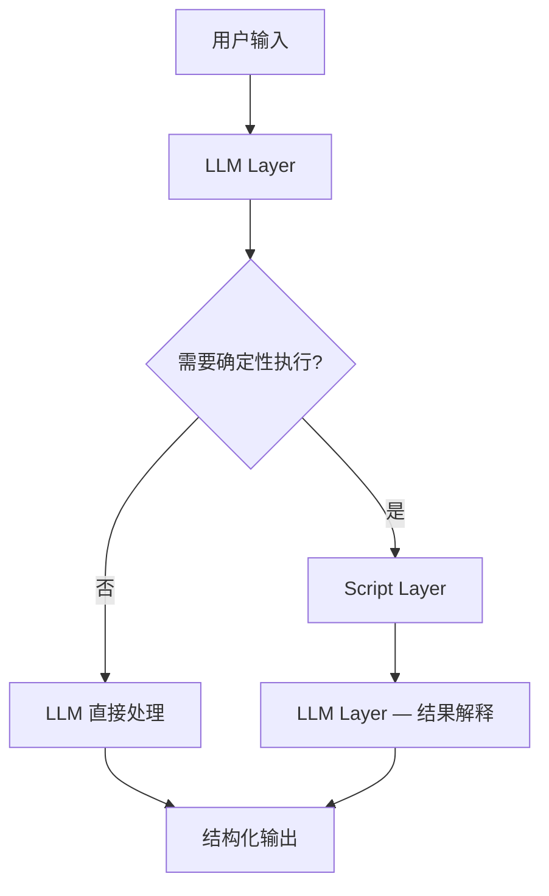

# 逻辑蓝图 (Logic Blueprint)

## Skill: {{SKILL_NAME}}
## Type: {{SKILL_TYPE}}

---

## 架构总览

核心原则：**让每个 Token 在最适合它的层工作。**



### 层级职责分配原则

| 判断标准 | 放在 Prompt | 放在 Script |
|----------|------------|-------------|
| 需要理解自然语言意图 | ✅ | |
| 需要注入领域知识/设计哲学 | ✅ | |
| 需要灵活判断和推理 | ✅ | |
| 需要确定性计算 | | ✅ |
| 需要正则/格式转换 | | ✅ |
| 需要文件系统操作 | | ✅ |
| 需要重复执行完全相同的逻辑 | | ✅ |

---

## 职责划分

### Prompt Layer（LLM 负责）

| 职责 | 维度归属 | 说明 |
|------|----------|------|
{{PROMPT_RESPONSIBILITIES}}

### Script Layer（CPU 负责）

| 脚本文件 | 职责 | 输入 | 输出 |
|----------|------|------|------|
{{SCRIPT_RESPONSIBILITIES}}

### Reference Layer（按需加载）

| 文件 | 内容 | 加载时机 |
|------|------|----------|
{{REFERENCE_RESPONSIBILITIES}}

---

## 效能优化方案

### 增强指令

{{DIRECTIVE_ENHANCEMENTS}}

### 补充约束

{{CONSTRAINT_ENHANCEMENTS}}

### 消减冗余

{{REDUNDANCY_REDUCTIONS}}

---

## 数据流向

```mermaid
sequenceDiagram
    participant User
    participant LLM as LLM (Prompt Layer)
    participant Script as Script (Code Layer)
    participant Ref as References (按需)

    User->>LLM: 原始请求
    LLM->>LLM: 意图识别（指令引导）
    {{SEQUENCE_STEPS}}
    LLM->>User: 格式化输出
```

---

## 重构后的文件清单

```
{{SKILL_NAME}}/
├── SKILL.md              # 指令 + 约束 Token（认知层）
├── scripts/
│   └── {{SCRIPT_FILES}}  # 确定性逻辑（执行层）
├── references/
│   └── {{REFERENCE_FILES}} # 低频详细内容（按需加载）
└── assets/
    └── {{ASSET_FILES}}   # 输出资源（不加载到 context）
```

---

> 请确认上述逻辑蓝图后，进入 Step 3: 最终交付。
