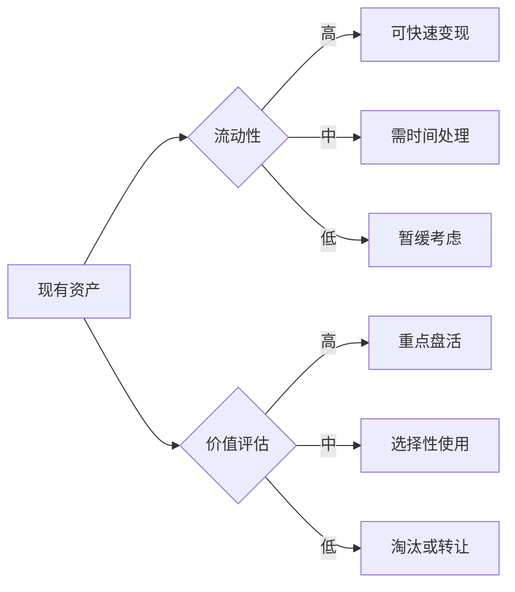
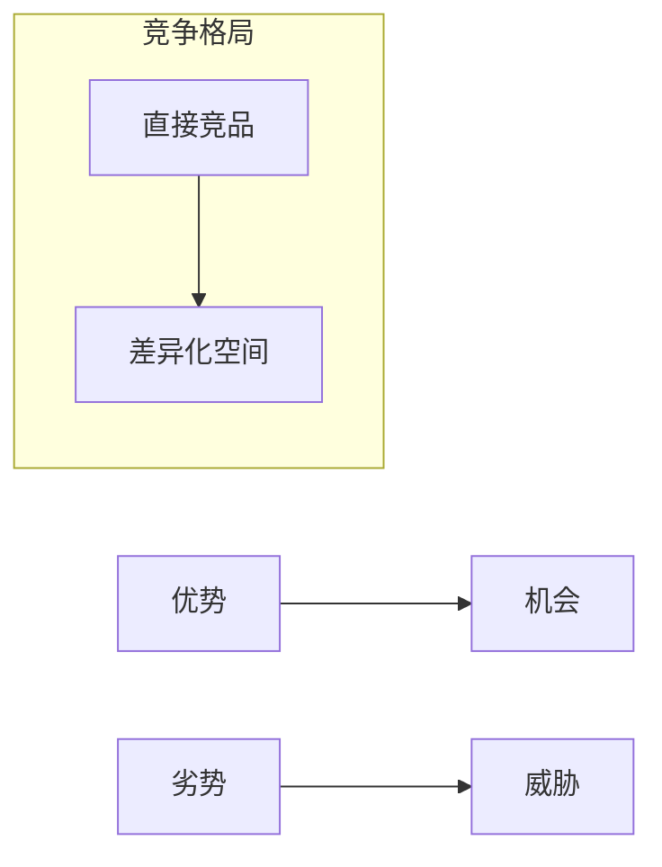
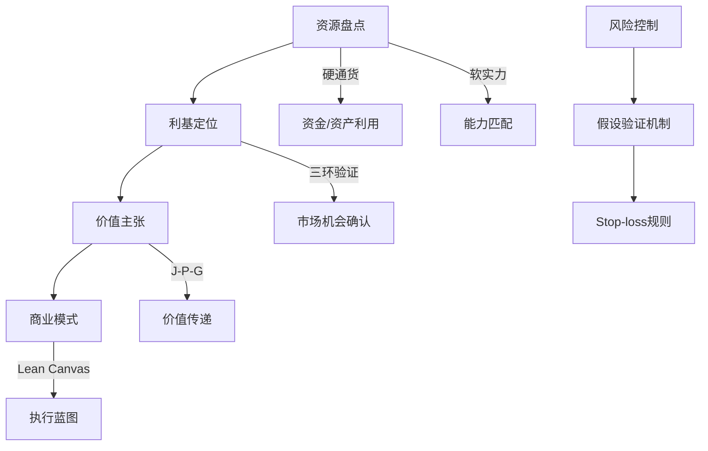

# OPC 阶段01: 资源盘点深度分析

## 核心框架：8维度资源清单

### 1. 硬通货资源（Money & Assets）
**分类：**
- **流动资金**: 可变现现金/短期投资
- **固定资产**: 房产/设备/车辆等
- **无形资产**: 专利/版权/域名等
- **数字资产**: 软件/代码/数据等

**盘点方法：**


**工具模板：**
- 资产清单表（名称/类型/估值/流动性/使用方式）
- 现金流预测表（6个月收支）

### 2. 软实力资源（Skills & Experience）
**分类：**
- **专业技能**: 行业know-how/技术能力
- **通用能力**: 管理/营销/沟通/写作
- **经验积累**: 项目经验/客户案例/失败教训
- **学习能力**: 快速学习新领域的能力

**评估模型：**
```
技能价值 = (市场需求 × 稀缺度) / 替代成本
```

**提升路径：**
- 技能缺口分析矩阵
- 70/20/10学习法则应用

---

# 阶段02: 利基定位深度分析

## 三环合一验证法

### 需求环（Demand Verification）
**验证问题：**
1. 问题真实存在？→ 用户调研/痛点访谈
2. 有付费意愿？→ 价格敏感性测试
3. 愿意为方案付费？→ MVP定价测试

**工具：**
- 需求热度地图
- 支付意愿问卷设计模板

### 竞争环（Competition Analysis）
**评估维度：**
- **数量**: 竞品数量及集中度
- **质量**: 竞品解决方案优劣
- **价格**: 市场价格区间
- **渠道**: 获客渠道差异性

**SWOT分析模板：**


### 收益环（Profitability Check）
**关键指标：**
- LTV/CAC ≥ 3
- 边际成本递减效应
- 规模经济潜力
- 复购率/续费率

**财务模型：**
```
预期月收入 = 目标客户数 × ARPU × 转化率
盈亏平衡点 = 固定成本 / (单价 - 可变成本)
```

---

# 阶段03: 价值主张深度分析

## Jobs-Pains-Gains模型详解

### Jobs（用户需求层次）
| 层次 | 典型Jobs | 示例 |
|------|---------|------|
| **功能性** | 解决问题/完成工作 | "快速整理文档" |
| **社会性** | 身份认同/社交需求 | "专业形象展示" |
| **情感性** | 情绪满足/自我实现 | "成就感/掌控感" |

**Jobs映射工具：**
- 用户画像卡
- Jobs层次分解图

### Pains（痛点层级）
| 层级 | Pain特征 | 缓解策略 |
|------|----------|----------|
| **显性** | 明确表达的不满 | 直接解决 |
| **隐性** | 未意识到的问题 | 痛点挖掘 |
| **未来** | 潜在风险担忧 | 预防性方案 |

### Gains（收益设计）
**增益设计原则：**
- **具体化**: "节省2小时"而非"更省时间"
- **量化**: 用数字说话
- **差异化**: 与竞品形成鲜明对比

---

# 阶段04: 商业模式深度分析

## Lean Canvas 9大模块

### 1. 问题（Problems）
**关键问题清单：**
- 客户遇到的核心痛点是什么？
- 这些问题是真实的吗？（验证方法）
- 问题的紧迫程度如何？

### 2. 解决方案（Solutions）
**解决方案设计：**
- 最小可行性产品（MVP）定义
- 核心功能优先级排序
- 技术实现路径选择

### 3. 关键指标（Key Metrics）
**指标体系：**
- 增长指标：用户获取/留存率/转化率
- 财务指标：LTV/CAC/毛利率
- 运营指标：服务成本/交付周期

### 高风险假设（High-Risk Assumptions）

**假设分类：**
| 假设类型 | 示例 | 验证难度 | 影响程度 |
|----------|------|----------|----------|
| **市场假设** | 目标市场规模足够大 | 高 | 极高 |
| **技术假设** | 技术方案可行 | 中 | 高 |
| **财务假设** | 盈利模式成立 | 中高 | 高 |
| **团队假设** | 执行能力足够 | 中 | 中 |

**假设验证计划：**
- 每月更新高风险假设列表
- 设置明确的验证成功/失败标准
- 预留应急预算应对假设失败

---

## 整合输出：OPC四阶段方法论



**下一阶段准备：** 进入MVP验证设计