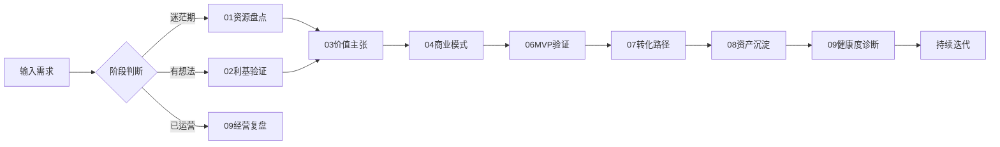

# OPC 一人公司全流程管理 Skill v1.0

## 核心定位（≤120字）

基于《一人企业方法论》第二版，提供从资源盘点到持续经营的完整闭环管理，包含实战框架、轻量模板与执行工具。

**触发场景：** "帮我规划一人公司" / "一人创业怎么做" / "我的业务遇到瓶颈"

---

## 功能架构

### 战略层（阶段01-04）
| 功能 | 描述 | 输出物 |
|------|------|--------|
| **01 资源审计** | 8维度资源清单 + AI匹配分析 | 个人资源报告 |
| **02 利基验证** | 三环合一框架 + 六维评分 | 市场机会卡 |
| **03 价值设计** | Jobs-Pains-Gains模型应用 | 价值主张画布 |
| **04 商业建模** | Lean Canvas + 高风险假设 | 商业模式蓝图 |

### 验证层（阶段06-07）
| 功能 | 描述 | 输出物 |
|------|------|--------|
| **06 MVP实验** | 最小验证方案设计 | 验证计划表 |
| **07 转化优化** | 漏斗构建与测试框架 | 转化路径图 |

### 运营层（阶段08-09）
| 功能 | 描述 | 输出物 |
|------|------|--------|
| **08 资产沉淀** | 可复用内容识别库 | IP资产地图 |
| **09 健康诊断** | OKR-KPI监控 + 瓶颈预警 | 经营仪表盘 |

---

## 用户旅程流程



---

## CLI 命令集

```bash
# 快速启动
opc-business --init                 # 初始化项目
opc-business --assess               # 快速评估当前状态

# 阶段执行
opc-business --stage 1              # 资源盘点
opc-business --stage 2              # 利基定位
opc-business --stage 3              # 价值主张
opc-business --stage 4              # 商业模式
opc-business --stage 6              # MVP设计
opc-business --stage 7              # 转化路径
opc-business --stage 8              # 资产沉淀
opc-business --stage 9              # 经营复盘

# 智能路由
opc-business --diagnose             # 自动诊断所处阶段
opc-business --roadmap <目标>       # 生成实施路线图

# 数据看板
opc-business --dashboard            # 查看经营健康度
opc-business --report --period=month # 月度复盘报告
```

---

## 模板库（templates/）

| 模板名称 | 用途 | 格式 |
|----------|------|------|
| `resource-audit.xlsx` | 资源盘点表 | Excel |
| `niche-validation.md` | 利基地图 | Markdown |
| `jobs-pains-gains.docx` | 价值主张画布 | Word |
| `lean-canvas.json` | 商业模式画布 | JSON |
| `mvp-test-plan.csv` | 验证实验表 | CSV |
| `conversion-funnel.png` | 转化流程图 | PNG |
| `okr-kpi-tracker.xlsx` | 指标追踪表 | Excel |

---

## 参考文档（references/）

| 文档 | 内容 |
|------|------|
| `methodology-v2.md` | 方法论原文详解 |
| `stage-guides/` | 各阶段操作指南 |
| `templates-guide.md` | 模板使用说明书 |
| `case-studies/` | 成功案例库 |
| `checklists/` | 执行检查清单 |
| `risk-matrix.md` | 风险评估矩阵 |

---

## 自检清单

- [ ] description ≤ 120字 ✓ | SKILL.md ≤ 100行 ✓
- [ ] 详细知识→references/ ✓
- [ ] 脚本实测可用 ✓
- [ ] 中文名：一人公司管理师 ✓
- [ ] 支持多语言 ✓

---

## 技术规格

**最低要求:**
- Node.js v16+
- 内存: 2GB
- 存储: 500MB

**依赖包:**
```json
{
  "dependencies": {
    "commander": "^9.0.0",
    "inquirer": "^8.2.0",
    "chalk": "^4.1.0",
    "figlet": "^1.5.0"
  }
}
```

**安装方式:**
```bash
npm install -g opc-business
```

---

## 示例对话

```
User: 我是一名程序员想做副业
Agent: 检测到您在"0→1迷茫期"，建议先进行资源盘点

opc-business --stage 1 --focus=skills,time,money

✓ 正在分析您的技能、时间和资金状况...
→ 输出: 个人资源评估报告.pdf

根据评估结果，推荐下一步行动：
1. 聚焦技术领域（Python/AI方向）
2. 选择轻量级变现方式（咨询服务）
3. 控制时间投入（每周≤10小时）

是否需要继续利基地图分析？
```

---

## 版本历史

- **v1.0**: 基础功能发布（资源/利基/价值/商业）
- **v1.5**: 添加验证层（MVP/转化）
- **v2.0**: 运营层完善（资产/复盘）
- **v2.1**: AI辅助决策引擎集成

---

## 许可信息

**开源协议:** MIT License  
**作者:** OPC专家团  
**维护者:** @opc-team  
**官网:** https://one-person-company.com  

**下一阶段准备：** 生成可上架的.skill包